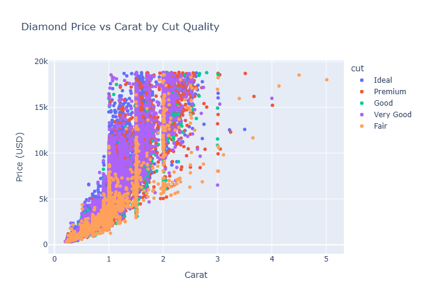

SSH url: git@github.com:israchowdhry/jhu_software_concepts.git

Name: Isra Chowdhry (ichowdh6)

Module Info: Module 10 Assignment: Data Dashboard Due on 04/05/2026 at 11:59 EST

Approach:

## Research Question
Can the price of a diamond be determined by its physical and quality features?

## Project Overview
This project analyzes the Kaggle Diamonds dataset to explore how diamond price is influenced by features such as carat and cut quality. The goal is to answer the research question through a combination of static and interactive visualizations, then present the findings in a Dash dashboard. The analysis suggests that carat is the strongest predictor of price, while cut quality also contributes to pricing differences.

## Visualization 1: Diamond Price vs Carat


This scatter plot shows a strong positive relationship between carat and price. As carat increases, price also increases, and the relationship appears nonlinear because larger diamonds become disproportionately more expensive. The vertical clustering of points reflects common market-preferred carat sizes, while the wider spread at larger carat values suggests that other factors such as cut, color, and clarity play a greater role in pricing larger diamonds.

## Visualization 2: Price Distribution by Cut Quality


This boxplot compares diamond price distributions across cut categories. Diamonds with higher cut quality, such as Premium and Ideal, tend to have higher median prices, although there is substantial overlap across all categories. This indicates that cut quality affects diamond price, but it is not as influential as carat in determining overall value.

## Visualization 3: Interactive Diamond Price vs Carat by Cut Quality


This visualization uses Plotly to show the relationship between carat and price while also incorporating cut quality through color. The interactive chart allows the viewer to hover over points and more closely inspect patterns in the data. Additionally, users can click on the legend to focus on specific cut categories, enabling a more detailed comparison of how each cut influences price. The plot reinforces that carat is the dominant factor in price, while cut quality provides additional explanation for variation among diamonds of similar size.

## Dashboard Summary
The dashboard combines these visualizations into a single-page Dash application that presents the main research question and the major patterns observed in the dataset. Together, the visualizations show that diamond price is primarily driven by carat, with cut quality influencing price as a secondary factor.

## Files Included
- `visualization.py` - creates all required visualizations
- `dashboard.py` - runs the Dash dashboard
- `price_vs_carat.png` - scatter plot of price vs carat
- `price_by_cut.png` - boxplot of price by cut quality
- `interactive_plot.png` - saved PNG of the Plotly visualization
- `interactive_plot.html` - interactive Plotly graph
- `requirements.txt` - required Python packages

## How to Run
First, install the required packages:

```bash
pip install -r requirements.txt
```

Next, generate the visualizations:

```bash
python visualization.py
```
Then run the dashboard:

```bash
python dashboard.py
```