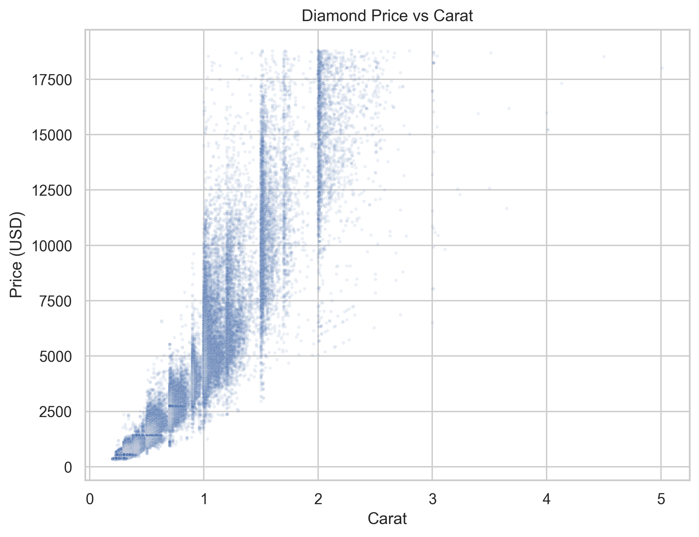
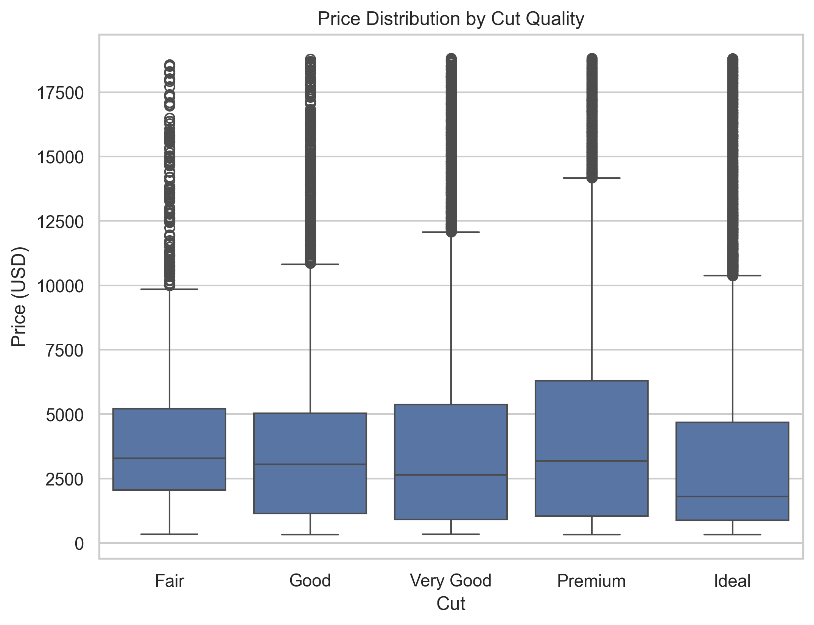

SSH url: git@github.com:israchowdhry/jhu_software_concepts.git

Name: Isra Chowdhry (ichowdh6)

Module Info: Module 10 Assignment: Data Dashboard Due on 04/05/2026 at 11:59 EST

Approach:

## Research Question
Can the price of a diamond be determined by its physical and quality features?

## Project Overview
This project analyzes the Kaggle Diamonds dataset to explore how diamond price is influenced by physical and quality-related features, especially carat and cut quality. The analysis is presented through a combination of static and interactive visualizations, followed by a Dash dashboard that brings these results together on a single page. The findings suggest that carat is the strongest predictor of price, while cut quality contributes additional variation in value.

## Approach
The project uses Python to generate three visualizations based on the diamonds dataset. Two static visualizations are created with Seaborn and Matplotlib and saved as PNG files, while one interactive visualization is created with Plotly and saved as an HTML file. The dashboard is built with Dash and imports the plotting functionality directly from `visualization.py`, allowing the visualizations to be generated and displayed within the app itself.

## Visualization 1: Diamond Price vs Carat


This scatter plot shows a strong positive relationship between carat and price. As carat increases, price also rises, and the pattern is nonlinear because larger diamonds become disproportionately more expensive. The vertical clustering of points reflects common market-preferred carat sizes, while the wider spread at higher carat values suggests that additional quality factors become more important among larger diamonds.

## Visualization 2: Price Distribution by Cut Quality


This boxplot compares diamond price distributions across cut categories. Diamonds with higher cut quality, such as Premium and Ideal, generally have higher median prices, but there is considerable overlap among all cut groups. This suggests that cut quality affects pricing, though it is not as strong a predictor as carat.

## Visualization 3: Interactive Diamond Price vs Carat by Cut Quality
This visualization is saved as `interactive_plot.html` and is also displayed interactively in the Dash dashboard.

This Plotly visualization shows the relationship between carat and price while incorporating cut quality through color. Users can hover over points to inspect values more closely and can click the legend to focus on specific cut categories for a more detailed comparison. The visualization reinforces that carat is the dominant driver of price, while cut quality helps explain variation among diamonds of similar size.

## Dashboard Summary
The dashboard combines the three visualizations into a single-page Dash application and includes a short explanation to guide the viewer toward a conclusion. The dashboard shows that diamond price is primarily driven by carat, with cut quality playing a secondary but meaningful role in explaining price differences. This aligns with the assignment requirement to present multiple visualizations and summarize the key trend in a clear dashboard format. The conversion step is used because Matplotlib figures cannot be displayed directly in Dash. Instead, they are converted into base64-encoded PNG images so they can be rendered using html.Img. This allows the dashboard to reuse the plotting functions from visualization.py while still displaying the static charts correctly. Plotly figures do not require this step because Dash can render them directly using dcc.Graph.

## Files Included
- `visualization.py` - generates the static and interactive visualizations
- `dashboard.py` - runs the Dash dashboard and imports plotting functionality from `visualization.py`
- `diamonds.csv` - dataset used for analysis
- `price_vs_carat.png` - static scatter plot of diamond price vs carat
- `price_by_cut.png` - static boxplot of price by cut quality
- `interactive_plot.html` - interactive Plotly visualization
- `requirements.txt` - required Python packages
- `README.md` - project documentation

## How to Run

First, install the required packages:

```bash
pip install -r requirements.txt
```

Next, generate the visualizations:

```bash
python visualization.py
```
Then run the dashboard:

```bash
python dashboard.py
```

Known bugs: No Known bugs